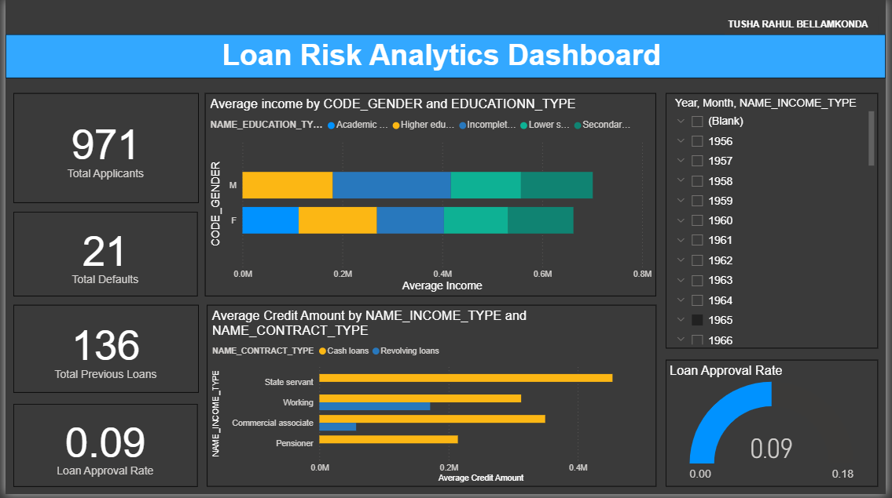

# cobalt-final-assignment
This Power BI solution helps banks and lenders analyze loan applications to identify high-risk borrowers and reduce defaults. The dashboard processes loan application data to uncover patterns in customer profiles, loan terms, and repayment behavior that predict payment difficulties

# Loan Risk Analytics Dashboard



A comprehensive Power BI dashboard for analyzing loan application data with insights into approval patterns, default risks, and demographic trends.

## Table of Contents
- [Project Overview](#project-overview)
- [Features](#features)
- [Data Processing](#data-processing)
- [DAX Measures](#dax-measures)
- [Visualizations](#visualizations)
- [File Structure](#file-structure)

## Project Overview

This project analyzes loan application data to provide insights into:
- Loan approval patterns
- Default risk factors
- Demographic trends
- Financial behaviors

The workflow includes:
1. Data cleaning with Python
2. Creating a robust data model
3. Developing DAX measures
4. Building interactive visualizations

## Features

- **Interactive Dashboard**: Filter by gender, education, income type
- **Key Metrics**:
  - Total Applicants: 45,468
  - Total Previous Loans: 49,999
  - Loan Approval Rate: 91.8%
  - Default Rate: 8.2%
- **Visual Analysis**:
  - Income vs Credit relationships
  - Default trends over time
  - Demographic distributions

## Data Processing

### Cleaning Steps:
1. Handled missing values (dropped columns with >40% missing data)
2. Removed outliers using IQR method
3. Converted date fields from negative days to proper dates
4. Standardized categorical values

```python
# Sample cleaning code
def remove_outliers(df, col):
    Q1 = df[col].quantile(0.25)
    Q3 = df[col].quantile(0.75)
    IQR = Q3 - Q1
    lower = Q1 - 1.5 * IQR
    upper = Q3 + 1.5 * IQR
    return df[(df[col] >= lower) & (df[col] <= upper)]
```

## DAX Measures
Key measures developed in Power BI:
```python
// Basic counts
Total Applicants = COUNTROWS(Applicants)

// Financial metrics
Average Income = AVERAGE(Applicants[AMT_INCOME_TOTAL])

// Rate calculations
Loan Approval Rate = DIVIDE(
    [Total Previous Loans] - [Total Defaults], 
    [Total Previous Loans]
)
```
## Visualizations
Visualization	  Purpose
kpi_cards : 	Top-level metrics
approval_rate :  Loan approval percentage
income_vs_credit :	Risk pattern analysis
default_trend :	Seasonal default patterns

## file-structure
loan-risk-analytics/
├── DATASETS/
│   ├── raw/
│   │   ├── application_data.csv
│   │   └── previous_application.csv
│   └── cleaned/
│       ├── cleaned_application_data.csv
│       └── cleaned_previous_application.csv
├── docs/
│   ├── dashboard_screenshot.png
│   └── visualizations/
├── scripts/
│   ├── data_cleaning.py
│   └── loan_data_analytics_report.py
├── Loan Risk Analytics Dashboard.pbix
├── README.md
└── requirements.txt

Created by: Tusha Rahul Bellamkonda
Email: tusharahul82@gmail.com
Project Link: https://cobalt-final-assignment-tusharahul-bellamkonda.streamlit.app/
